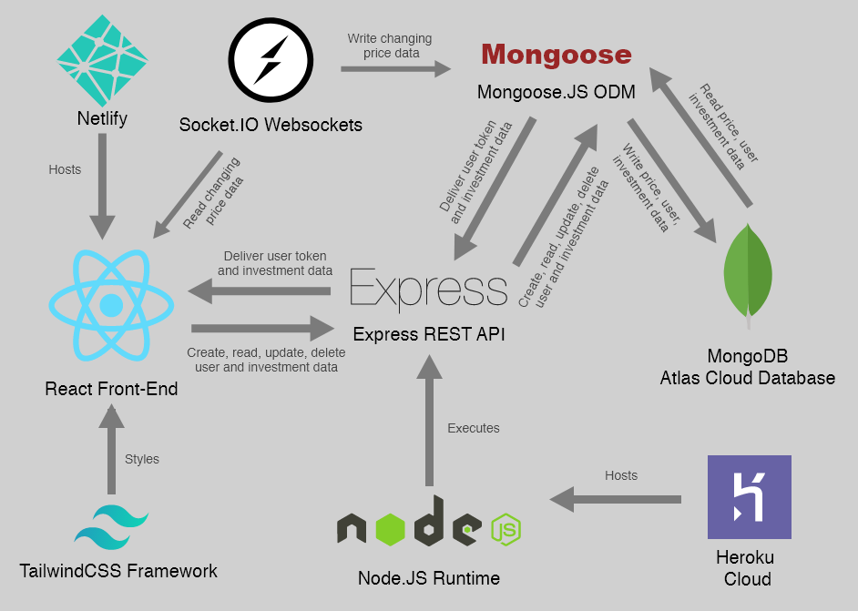
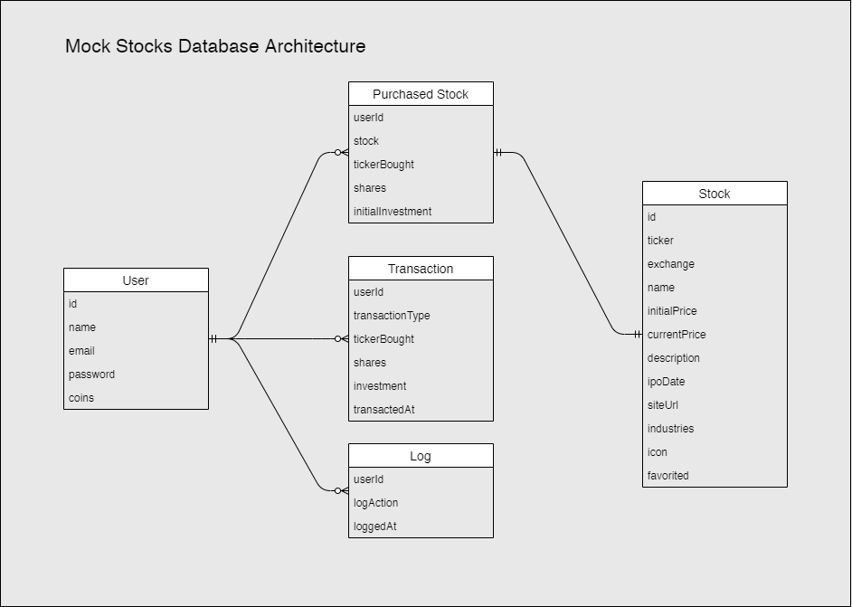
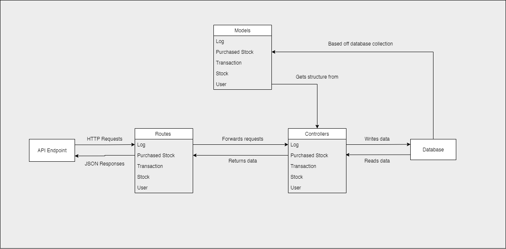
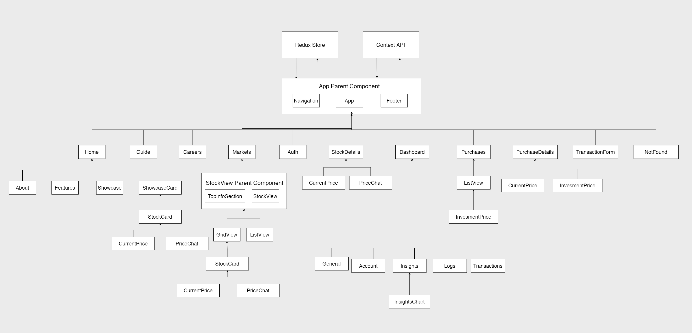
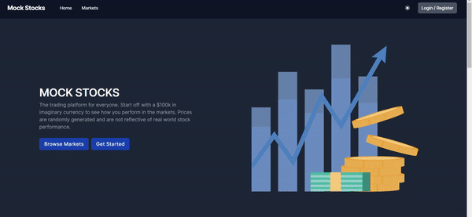
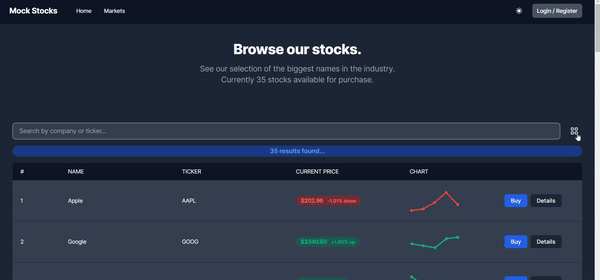
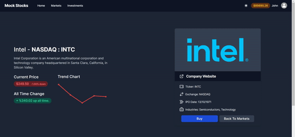
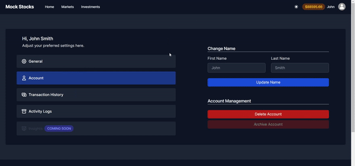

# [Mock Stocks Trading Platform](https://epic-swanson-085a9a.netlify.app/)

## Overview

Mock Stocks is a trading and investment platform simulation built with the [MERN](https://www.mongodb.com/mern-stack) stack and utilizing [Socket.IO](https://socket.io/) for real time price updates. It is not a reflection of the real world markets and stock performance. You can visit the site [here.](https://epic-swanson-085a9a.netlify.app/)

## Table of Contents

- [Tech](#tech)<br/>
- [Data](#data)<br/>
- [Developing](#developing)<br/>
- [Architecture](#architecture)<br/>
- [Front-End Insights](#front-end-insights)<br/>
- [Back-End Insights](#back-end-insights)<br/>
- [Demos](#demo-gifs)<br/>

## Tech

This project utilizes the [MERN](https://www.mongodb.com/mern-stack) stack and [Socket.IO](https://socket.io/) library. For authentication, a [JWT](https://jwt.io/) solution was implemented.

**Front-End**

- [React](https://reactjs.org/)
- [Redux](https://redux.js.org/)
- [TailwindCSS](https://tailwindcss.com/)
- [Chart.JS](https://www.chartjs.org/)

**Back-End**

- [Node.JS](https://nodejs.org/en/)
- [Express.JS](https://expressjs.com/)
- [Mongoose.JS](https://mongoosejs.com/)
- [Socket.IO](https://socket.io/)

**Database**

- [MongoDB Atlas](https://www.mongodb.com/cloud/atlas)

**Authentication**

- [JSON Web Tokens](https://jwt.io/)

## Data

Stock data in this project was generated via [Mockaroo](https://www.mockaroo.com/) and is not reflective of real world market prices.

**Design**

Refer to the `Database Architecture` diagram in the [Architecture](#architecture)<br/> section below to see the various data models used in the database. See the [`/backend/models`](https://github.com/JackyTea/Mock-Stocks/tree/main/backend/models) directory for implementation details.

**Stock**

This project uses [JSON](https://www.json.org/json-en.html) to represent stock data in the form of:

```json
[
  {
    "id": 0,
    "ticker": "String",
    "exchange": "String",
    "name": "String",
    "initialPrice": 0.00,
    "currentPrice": 0.00,
    "description": "String",
    "ipoDate": "String",
    "siteURL": "String",
    "industries": ["String", "String"],
    "icon": "URL",
    "favorited": true,
    "timesBought": 0
  }
]
```

The [schema](https://mongoosejs.com/docs/guide.html) of this model can be found in [`/backend/models/stock.js`](https://github.com/JackyTea/Mock-Stocks/blob/main/backend/models/stock.js)

## Developing

To run this application locally, you will need the following prerequisite programs:

- [Node.JS and NPM](https://nodejs.org/en/)
- [Create React App](https://github.com/facebook/create-react-app)
- [MongoDB](https://www.mongodb.com/)

**Back-End Setup**

First, install the necessary packages via:

```
npm i
```

Refer to the [`package.json`](https://github.com/JackyTea/Mock-Stocks/blob/main/backend/package.json) in the [`/backend`](https://github.com/JackyTea/Mock-Stocks/tree/main/backend) directory for more information about what is being installed.

Then, setup the `.env` file in the root of the [`/backend`](https://github.com/JackyTea/Mock-Stocks/tree/main/backend) directory. (**Note**: this will be gitignored)

```bash
# for mongodb connection
MONGO_CONNECTION_STRING=mongo_secret_here

# for authentication via signing tokens
JWT_SECRET=jwt_secret_here

# for guest account login (mongo objectID)
GUEST_ID=guest_id_here
```

Now you can spin up the backend. Default port is `5000`. This can be changed in [`index.js`](https://github.com/JackyTea/Mock-Stocks/blob/main/backend/index.js#L54).

```bash
# start server
node .

# explicit command
node index.js
```

**Front-End Setup**

First, install the necessary packages via:

```
npm i
```

Refer to the [`package.json`](https://github.com/JackyTea/Mock-Stocks/blob/main/frontend/package.json) in the [`/frontend`](https://github.com/JackyTea/Mock-Stocks/tree/main/frontend) directory for more information about what is being installed.

Then, setup the `.env` file in the root of the [`/frontend`](https://github.com/JackyTea/Mock-Stocks/tree/main/frontend) directory. (**Note**: this will be gitignored) Also see that `REACT_APP_GUEST_EMAIL` and `REACT_APP_GUEST_PASS` take [base64](https://en.wikipedia.org/wiki/Base64) encoded strings. You can easily encode your credentials using this [site](https://www.base64encode.org/) or with the [btoa()](https://developer.mozilla.org/en-US/docs/Web/API/WindowOrWorkerGlobalScope/btoa) function.

```bash
# backend connection to REST API
REACT_APP_STOCKS_API=api_url

# email of the guest account (encoded)
REACT_APP_GUEST_EMAIL=base64_encoded_string

# password of the guest account (encoded)
REACT_APP_GUEST_PASS=base64_encoded_string
```

Now you can spin up the frontend. Default port is `3000` for a [create-react-app](https://github.com/facebook/create-react-app) project.

```bash
# start react app
npm start
```

## Architecture

The overall architecture is a front-end [React](https://reactjs.org/) application connected to [Express](https://expressjs.com/) [REST API](https://www.redhat.com/en/topics/api/what-is-a-rest-api#:~:text=A%20REST%20API%20also%20known,by%20computer%20scientist%20Roy%20Fielding) with a [MongoDB](https://www.mongodb.com/) database.

**System Architecture**

Big picture view of the application at a glance.



**Database Architecture**

MongoDB database structure following [normalized data models.](https://docs.mongodb.com/manual/core/data-model-design/#normalized-data-models)



**Back-End Architecture**

[MVC-like](https://codedec.com/tutorials/workflow-and-folder-structure-for-mern-application/) architecture for manipulating, reading and writing data to the database, returning it as JSON responses to the frontend.



**Front-End Architecture**

[Component hierarchy](https://reactjs.org/docs/thinking-in-react.html#step-1-break-the-ui-into-a-component-hierarchy) of the React application that splits the UI into reusable components to avoid code duplication and increase maintainability.



## Front-End Insights

**Technical Decisions**

*Why React?*

[React](https://reactjs.org/) provides the component based front-end framework needed to easily organize the project's many parts into easy to maintain and reuseable modules. React also provides many tools to help develop, debug and test your web application (e.g. [Context API](https://reactjs.org/docs/context.html) for light state management, [React Profiler](https://reactjs.org/docs/profiler.html) for optimizations, and [React Testing Library](https://testing-library.com/docs/react-testing-library/intro/) for unit and integration testing). Additionally, it is a well-documented framework with a large community backing it to provide support.

*Why Redux?*

[Redux](https://redux.js.org/) provides a robust state-management system for the amount of data that this project handles. It provides a centralized store of data that is independent from the main app and can be accessed by any component without having to pass data down the component tree or lift state up. The app has data models for stocks, investments, activity logs, transactions logs and user profile data, making Redux a good choice for managing data as opposed to the [Context API](https://reactjs.org/docs/context.html) which is not as good for large amounts of data.

*Why Redux Thunk?*

[Redux Thunk](https://github.com/reduxjs/redux-thunk) is middleware for [Redux](https://redux.js.org/) that allows for actions to be called with a function as the return value (the thunk itself). This function contains a `dispatch` parameter for dispatching actions to the reducer. This allows for [side effects](https://www.yld.io/blog/the-not-so-scary-guide-to-functional-programming/#:~:text=A%20side%20effect%20is%20when,described%20as%20having%20side%20effects.) to occur first (e.g. an asynchronous API call) before dispatching the synchronous action.

*Why TailwindCSS?*

[TailwindCSS](https://tailwindcss.com/) is utility-first CSS framework that provides a set of primitive classes known as utilities for styling the application in a unopinionated way. These primitive classes include borders, colours, displays, positioning and spacing. TailwindCSS also allows for purging of unused css to reduce production file sizes via [PurgeCSS](https://purgecss.com/). It also provides easy configuration for [dark mode](https://tailwindcss.com/docs/dark-mode).

*Why Chart.JS?*

[Chart.JS](https://www.chartjs.org/) is an easily configurable library for rendering charts via Javascript. It is quick to setup and use, offering animations out of the box and responsive properties.


**Maintainability**

*File Structure*

An organized file hierarchy is used to keep things easy to find.

```
cypress
public
src
|_actions
|_api
|_assets
|_components
| |_componentA
| |_componentB
| |_componentC
|_constants
|_contexts
|_reducers
|_tests
App.jsx
index.js
index.css
setupTests.js
```

*Component Based Architecture*

The application is organized into reusable components that can be plugged into any part of application to avoid code duplication and maintain a clean structure. This also helps with performance as state changes for that component only re-render it instead of the whole virtual DOM._

*Redux and Context for Loose Coupling*

For global states, [Redux](https://redux.js.org/)  and [Context API](https://reactjs.org/docs/context.html) are used to keep data in a centralized location and avoid the root `App` component become a monolith. This promotes loose coupling between components with different responsibilities. Props are only passed to sub-components of components that are related to each other. (e.g. the `StockView` passes props to its children components of `ListView` and `GridView` but not to other independent modules).

*Naming Conventions*

Components have a descriptive name about their role in the UI. (e.g. `StockCard` displays a stock and its info in a card-like container).

*Future Plans To Improve Maintainability*

- Further componentization of UI modules
- Linting via [ESLint](https://eslint.org/) to enforce strict coding style and standards such as the [AirBnB style guide](https://github.com/airbnb/javascript/tree/master/react). (This will also help with open-sourcing as contributors will have to follow a standard.)
- Migration to [TypeScript](https://www.typescriptlang.org/) for type-safety, self-documentation and improved intellisense. TS makes it easy for the project to scale by catching errors before run time and enforcing stricter coding.

**Scalability**

*Codebase*

As described in the **Maintainability** section above, the codebase is organized into independent units with a incoming data being globally accessible and not store in a monolithic component. This makes the application scalable from a code standpoint, allowing for multiple developers to contribute and maintain easily.

*Components*

The component architecture promotes single responsibility and separation of concerns. (e.g. `GridView` is responsible for displaying a grid like view, while `Dashboard` displays user settings and info, very different responsibilities that are loosely coupled.)

*Testing Strategy*

Small [Jest](https://jestjs.io/) unit tests to verify correctly loading UI components and a small end-to-end [Cypress](https://www.cypress.io/) test were implement. Testing strategy still has to be expanded.

Priority (work from bottom up)
1. High Value features (stock market display and investments display, transaction form)
2. Edge cases in high value features (entering too many shares in the transaction form should display an error and not let the transaction go through)
3. Things easy to break (to be discovered)
4. Basic component testing

Future plans include:
- increasing unit test coverage for all components
- end-to-end tests for common user flows such as selling investments and making changes to the profile


**Performance**

*Using The Production React Build*

The [production build of React](https://reactjs.org/docs/optimizing-performance.html#use-the-production-build) minifies code and bundles it for smaller size, optimizations and better performance.

*Removing Unused CSS*

[TailwindCSS](https://tailwindcss.com/) takes advantage of [PurgeCSS](https://purgecss.com/) to remove unused CSS for smaller file sizes in the final production build.

*Avoiding Data Mutation in States*

React makes a copy of state and compares it to a previous snapshot of the state before re-rendering a component if there are differences. Creating new objects via methods like `filter()` and `map()` will mean React only has to do a shallow check before deciding to re-render or not. Mutation causes issues as React has to traverse the mutated object like an array (since the array still has the same address but different values, React will have to do a deep check) to find the difference, taking much more time.

*Asynchronous API Calls*

Asynchronous API calls prevent the UI from being unresponsive while requests are made to the backend. They are done in the background while the user can still interact with the UI. Synchronous calls will take time and hinder the loading of the page, leading to a bad user experience.

*Pagination of Large Data Collections*

Pagination is to display incoming stock data for both user experience and avoiding too many DOM elements on the page at the same time. (This can let us scale to bigger data collections later on). The chart animations may hinder webpage performance so limiting them on the screen helps with performance.

*Future Plans To Improve Performance*

- Elimination of unused code and optimizing algorithms used in methods.

- Optimization using [React Profiler](https://reactjs.org/docs/profiler.html) and "how often a React application renders and what the “cost” of rendering is. Its purpose is to help identify parts of an application that are slow and may benefit from optimizations such as memoization"

- Use [code-splitting](https://reactjs.org/docs/code-splitting.html) to lazily load things on-demand instead of all at the time.

- Caching API calls for stocks so a request only has to be made once. There will still be open WebSocket connections for updating the stock prices. (With stock data being dynamic, this may or may not be feasible)

- Implement caching for static content (such as certain homepage and header components) and delivering them via a [CDN](https://en.wikipedia.org/wiki/Content_delivery_network) or using [SSR](https://www.omnisci.com/technical-glossary/server-side-rendering#:~:text=Server%2Dside%20rendering%20(SSR),rendered%20page%20to%20the%20client.) (server side rendering) to improve load times.

- Converting the application to a PWA ([Progressive Web App](https://web.dev/what-are-pwas/)) to take advantage of caching, offline availability and native mobile features.


**Security**

*Client Side Validation Only For UX*

All validations will be made server-side and any validations made on the client-end will be purely for UI/UX (e.g. showing an error on buying too many shares of a stock). The server will do the real validations. All clients will be treated as if they are malicious, so incoming requests must be validated server-side.

*Future Plans To Improve Security*

- Store JWT Tokens in `httpOnly` cookie to avoid Cross-Site Scripting [XSS](https://owasp.org/www-community/attacks/xss/) attacks. There is still a vulnerability to Cross-Site Request Forgery [CRSF](https://owasp.org/www-community/attacks/csrf) attacks that the `SameSite=strict` flag may mitigate slightly but there is no foolproof security. See this [StackOverflow article on storing JWT tokens](https://stackoverflow.com/a/65956741).

**Accessibility**

*Future Plans to Improve Accessibility*

- Using an accessibility checker such as one from the [list here](https://www.w3.org/WAI/ER/tools/) to meet Web Content Accessibility Guidelines [WCAG 2.1](https://www.w3.org/WAI/WCAG21/quickref/) to make sure the site is accessible to visually, audio impaired with semantic tags, labels and structure of the DOM.

- Implement [i18next](https://react.i18next.com/) for  internationalization. (Supporting various languages for non-English speakers).

## Back-End Insights

**Technical Decisions**

*Why Node.JS?*

[Node.JS](https://nodejs.org/en/) allows for JS to be written on the  back-end, enabling rapid development and lower learning curve for developers. It is a flexible, unopinionated environment that supports many libraries for building custom solutions. Its single-threaded event loop architecture eliminates the need for thread management or the management of connections/pools. It’s also resource-efficient, using a fraction of the memory of typical event processing systems and is whyNode.js is used by some of the most high traffic sites on the web, including Twitter, Zillow and Discord. It is also well documented and has a large community backing it for support.

*Why Express.JS*

[Express.JS](https://expressjs.com/) is a fast, unopinionated, minimalist web framework for Node.js, it is widely used and has a good community behind it. It allows for quick development of a web server supporting RESTful methods (GET, POST, PUT, PATCH, DELETE, etc...).

*Why MongoDB?*

[MongoDB](https://www.mongodb.com/) is a widely used NoSQL database that allows for a flexible schema without always having to write schema migrations like in relational databases. It is also performant, highly scalable and supports indexing. For me, MongoDB is easy to setup and deploy, allowing for fast development. Also supports [ACID](https://database.guide/what-is-acid-in-databases/) transactions [unlike other NoSQL databases](https://www.mongodb.com/nosql-explained/nosql-vs-sql).

*Why SocketIO?*

[Socket.IO](https://socket.io/) is a WebSocket library that enables realtime, bi-directional communication between web clients and servers. For the purpose of updating stock prices frequently, a websocket solution is better than constantly polling the server.

**Maintainability**

*MVC-Like Structure*

The MVC-Like structure separates parts of the backend into manageable and maintainable sections. Views (routes), models (Mongo schemas) and controllers that are accessed via the routes.

*Future Plans to Improve Maintainability*

- Enforce a strict linting standard for code style and practices

**Scalability**

*Future Plans to Improve Scalability*

- Horizontal scaling of servers with more [Heroku Dynos](https://www.heroku.com/dynos#:~:text=The%20containers%20used%20at%20Heroku,on%20a%20user%2Dspecified%20command.&text=Dynos%20are%20the%20building%20blocks,app%2C%20from%20simple%20to%20sophisticated.) and using load balancing to distribute network requests.

- Adding redundancy and high availability with [replication](https://docs.mongodb.com/manual/replication/)

- Vertical scaling not really the best idea as you can only make a machine so powerful to handle load.

**Performance**

*Future Plans To Improve Performance*

- Possibly caching stock data in memory on the server to avoid too many database queries.

- Make use of more [indexes](https://docs.mongodb.com/manual/indexes/) to improve lookup times and avoid collection traversals.


**Security**

*JWT and Future Plans to Improve Security*

[JWT](https://jwt.io/) was chosen as the authentication method as they are lightweight and do not take up space on server memory, instead they are stored client side and allows the server to horizontally scale easier as opposed to sessions. Only issue is the security vulnerability against XSS attacks where a malicious client may abuse the token. This is why I enforced a short expiry time, only use server-side validation for requests and am looking into storing the token in an httpOnly cookie as opposed to in localStorage where it can be easily read by malicious javascript injections.

**Testing Strategy**

No current testing strategy for the backend portion of this application.

*Future Plans To Improve Testing Strategy*

- Implement unit, integration and e2e tests starting from small units and using those tests to build up to critical features.

## Demo GIFs

**Home Page**



**Browsing Markets**



**Buying A Stock**



**User Settings and Logging**


